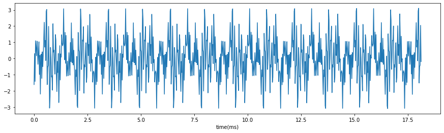
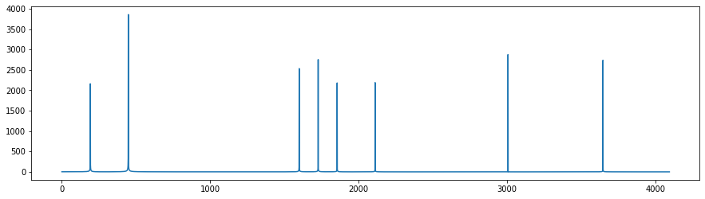

***********************************************
FIR filter implementation and simulation
***********************************************

Introduction
=======================
For those who are already familiar with FPGA design, you can optionally do this lab to implement a FIR filter with VHDL.

In this lab you are required to design a FIR filter and simulate it in the Vivado. You have to finish the code in ./Src/FIR.vhd and get the simulation running. 

Note: Don't ask question before Googling, if you cannot figure the provided code out, please follow the four labs in the main site.

Procedures
=================

In ./Src/stimuli.txt is a time domain signal with 8 frequency components sampled at the frequency of 44.1 kHz.

The following figure is the spectrum of the signal in stimuli. There are 8 frequency components in it.

You have to design a low pass FIR filter to remove six frequency components with higher frequencies.

After you design FIR filter coefficients in python or matlab, you are required to implement a FIR filter with VHDL code and complete the ./Src/FIR.vhd. A testbench is provided for you to simulate your code in Vivado. A logiCORE IP FIR Compiler is integrated in Vivado alaready. Feel free to use any library or online resources.

In the lab report, you have to show evidence of the simulation result, filter design procedures, digital filter response, and simulation output analysis.

report
======================

On March 27th, you have to submit a report with the screenshot of the simulation. The lab report has to include the following sections:

     * Introduction
     * procedures
     * Results
     * Discussion/Conclusion
     * Reference
     * Appendix(code and screenshots)

Academic Honesty
========================
You must acknowledge your work including figures, codes and writings are belonging to you with your signature on the front page of all submitted reports. If any similarity in the code, comments, customized program behavior, report writings and/or figures are found, both the helper (original work) and the requestor (duplicated/modified work) will be called for academic disciplinary action including failure of this course, and student's advisor/department will be notified.

`Illinois Tech Code of Academic Honesty <https://web.iit.edu/student-affairs/handbook/fine-print/code-academic-honesty>`_

Lab open Hours
========================
From March 2nd to March 27th, the lab SH310B will be open on weekdays except each Friday and spring break from 10am to 5pm. Please arrange your time wisely.